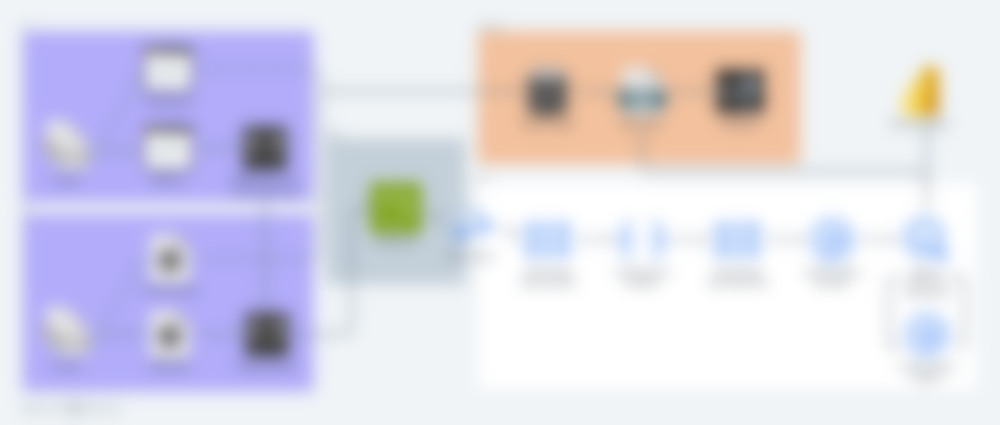

# PostHog Integration

## Overview

Introduce the adoption of PostHog (a CDP platform) as an additional analytics on our websites.

## Data Isolation

Create a seperate PostHog API Key for each environment to ensure data isolation.

| Env | API Key |
| - | - |
| `dev` | xxxx-dev-xxxxxxx |
| `staging` | xxxx-staging-xxxxxxx |
| `prod` | xxxx-prod-xxxxxxx |


## User Tracking & Identity

PostHog automatically generates a `distinct_id` on the first visit (stored in localStorage or cookies).

There are two types of `distinct_id`:

- Anonymous `distinct_id`

- Identified `distinct_id` (after stitching)


## User Identity Stitching Approach

Sample frontend code using **posthog.identify()**:

```js
  // Initialize PostHog
  posthog.init('ph_project_api_key', {
    api_host: 'https://app.posthog.com',
  });

  // 1. Anonymous visit — automatically tracks pageview
  posthog.capture('pageview', { page: 'index' });

  // 2. When user logs in successfully
  function onLoginSuccess(user) {
    posthog.identify(user.id, { email: user.email });
    posthog.capture('login_success', { plan: user.plan });
  }

  // 3. On logout (reset the identity)
  function onLogout() {
    posthog.reset();
  }
```

Sample backend code using **posthog.identify()**:

```Python
import posthog

posthog.api_key = "ph_project_api_key"
posthog.host = "https://app.posthog.com"

# When user signs up or logs in
posthog.identify("user_123", properties={"email": "user@example.com"})
posthog.capture("user_123", "login_success")
```


## Events Table Preview

### Example 1: Anonymous Visit Record

| event | distinct_id | person | timestamp |
| - | - | - | - |
| `pageview` | `ph_anonymous_8d4b1c9e-9b1c-42a3-b3b5-cf0a6e52a04f` | (Anonymous) | 2025-10-31 12:03 |

### Example 2: Anonymous Visit Record After Identity Stitching

| event | distinct_id | person   | timestamp |
| - | - | - | - |
| `pageview` | `ph_anonymous_8d4b1c9e-9b1c-42a3-b3b5-cf0a6e52a04f` | user_123 | 2025-10-31 12:03 |
| `login_success` | `user_123` | user_123 | 2025-10-31 12:05 |

As we see, Posthog will automatically rewrites the person column itself once identity stitching is done.


## Avoid Merging Multiple Logins

When a user logs in with a different account, you need to reset the PostHog identity first — otherwise, events from both accounts will merge into the same person record, which can cause incorrect identity merging (cross-account stitching).

To prevent this situation, the `distinct_id` must be reset after logout.

```js
// After each logout, call:
posthog.reset();
```

## Architecture

This diagram shows how the adoption will take place within our existing data pipeline architecture.

