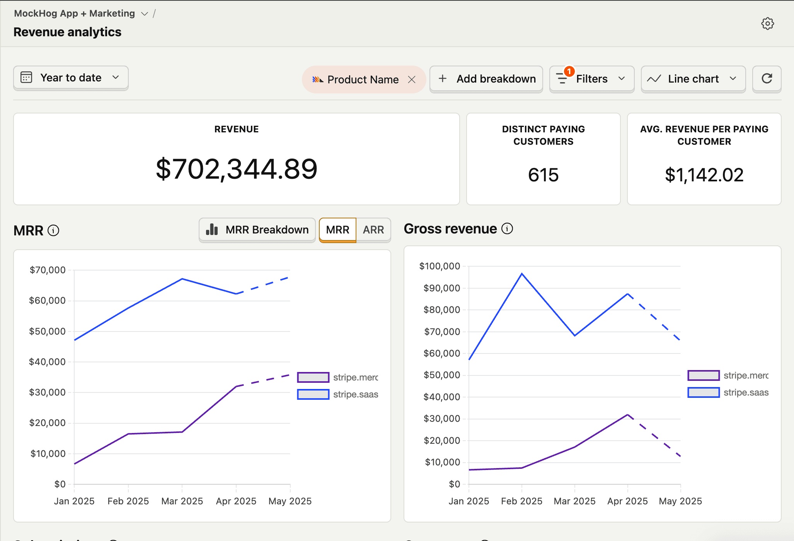

# PostHog's Revenue Analytics Integration

## Overview

Introduce the integration of the PostHog's [Revenue Analytics](https://posthog.com/docs/revenue-analytics) (beta) through the SDK.


## Configuration

According to [Capturing revenue events doc](https://posthog.com/docs/revenue-analytics/capture-revenue-events): you must capture an event with a revenue property (and optionally currency) and configure it in the Revenue section. 

Without that configuration, PostHog won’t treat your event as revenue-bearing.

You should add the `revenue` property only for purchase or transaction events where you want PostHog’s [Revenue Analytics](https://posthog.com/docs/revenue-analytics) to compute metrics like total sales, MRR, or ARPU.


## Revenue Analytics (beta)

Once you send events as configured, PostHog records them as revenue events.

The Revenue Analytics dashboard aggregates them by:

- Total revenue over time

- MRR/ARR

- Number of active subscriptions

- Churn (via cancellation events)

Sample screenshot from PostHog:




## Types of Revenue Events

PostHog’s Revenue Analytics is designed to handle all revenue-related events, including recurring subscriptions and one-time purchases.

| Type | Required Properties | Example Event |
|-|-|-|
|Subscription / Recurring | `revenue`, `currency`, `subscription_id`, `is_recurring: true` | `subscription_renewed`, `subscription_started` |
| One-Time Purchase | `revenue`, `currency`, no `subscription_id` and `is_recurring`: false (or omitted) | `order_completed`, `purchase_completed`

Notes

- The revenue property must be numeric (not a string).

- Only events containing a revenue property are visible under Revenue Analytics


## Example Revenue Event Payloads
### Subscription (Recurring Revenue)
```js
posthog.capture('subscription_renewed', {
  distinct_id: 'user_001',
  revenue: 9.99,
  currency: 'USD',
  subscription_id: 'SUB_123',
  is_recurring: true,
  plan: 'basic_monthly',
  transaction_id: 'TXN_56789'  // Stripe transaction id
});
```

### One-Time Purchase
```js
posthog.capture('order_completed', {
  distinct_id: 'user_002',
  revenue: 49.99,
  currency: 'USD',
  product_id: 'PROD_456',
  is_recurring: false  // or omitted
});
```

### Tipping 
```js
posthog.capture('tip_sent', {
  distinct_id: 'user_001',
  revenue: 5.00,
  currency: 'USD',
  tip_type: 'creator_support',  // custom classification
  recipient_id: 'creator_987',  // optional: who received the tip
  platform_fee: 0.5             // optional breakdown
});
```

Notes

According to the [FAQ document](https://posthog.com/docs/revenue-analytics/common-questions) on currency support: 

>PostHog Revenue Analytics will **automatically convert revenue from other currencies into your chosen reporting currency**. If someone makes a purchase in Canadian Dollars (CAD) and your reporting currency is US Dollars (USD), it's converted into USD in PostHog to ensure consistency.
>
>PostHog's currency conversion data is sourced from Open Exchange Rates. The exchange rate data is updated hourly and stored with daily granularity.

---

### Campaigns

Revenue attribution to campaigns (via UTM properties)

Example with UTM properties Included
```js
posthog.capture('purchase_completed', {
  distinct_id: 'user_123',
  revenue: 49.99,
  currency: 'USD',
  product_id: 'PROD_123',
  utm_source: 'facebook',
  utm_campaign: 'summer_sale'
});
```


### Coupons

Revenue attribution to coupon (via coupon properties)

Example with coupon properties Included
```js
posthog.capture('purchase_completed', {
  distinct_id: 'user_123',
  revenue: 49.99,
  currency: 'USD',
  product_id: 'PROD_123',
  coupon: '2025_summer_sale',
});
```


### Cancel a Subscription

Revenue to cancel should be zero

Example 
```js
posthog.capture('subscription_cancel', {
  distinct_id: 'user_001',
  revenue: 0,
  currency: 'USD',
  subscription_id: 'SUB_123',
  transaction_id: 'TXN_56789',
  cancel_reason: 'too_expensive'  // optional
});
```

### Refund a Subscription

Revenue to refund should be negative amount

Example 
```js
posthog.capture('subscription_refund', {
  distinct_id: 'user_001',
  revenue: -9.99,
  currency: 'USD',
  subscription_id: 'SUB_123',
  transaction_id: 'TXN_56789',
  refund_reason: 'user_request'  // optional
});
```
